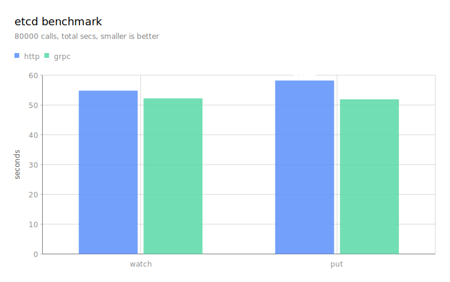

# etcd-benchmark
etcd http/grpc performance testing

## background

What is the difference in the efficiency of accessing etcd with http and grpc respectively?

We use below client programs to do the test:
1. http [go-http](https://pkg.go.dev/net/http#Client), access etcd grpc gateway, http keepalive enabled
2. grpc [go-etcd](https://pkg.go.dev/go.etcd.io/etcd/client/v3)

## test

```bash
# http put
go run http.go -c 10 -n 8000 -host http://httpbin.local:2379 -put

# grpc put
go run grpc.go -c 10 -n 8000 -host http://httpbin.local:2379 -put

# you could watch the connections to etcd
watch -n 3 "ss -tnp '( dport = :2379 )' | sort -k6"

# http watch
# in terminal-1
go run http.go -c 10 -n 8000 -host http://httpbin.local:2379 -watch
# in terminal-2, raise traffic to watch
go run grpc.go -c 10 -n 8000 -host http://httpbin.local:2379 -put

# grpc watch
# in terminal-1
go run grpc.go -c 10 -n 8000 -host http://httpbin.local:2379 -watch
# in terminal-2, raise traffic to watch
go run grpc.go -c 10 -n 8000 -host http://httpbin.local:2379 -put
```



* watch performance is almost the same,
because http uses only one tcp connection and chunked streaming for receiving watch events.
* put performance, grpc is about `13%` better than http, and the cpu of etcd server is smaller than grpc client.
  * http uses multiple tcp connections, because http/1.1 cannot multiplex requests
  * http has bigger size of packets than grpc (http/2)
  * etcd uses grpc-gateway to bridge the traffic between http and grpc internally


